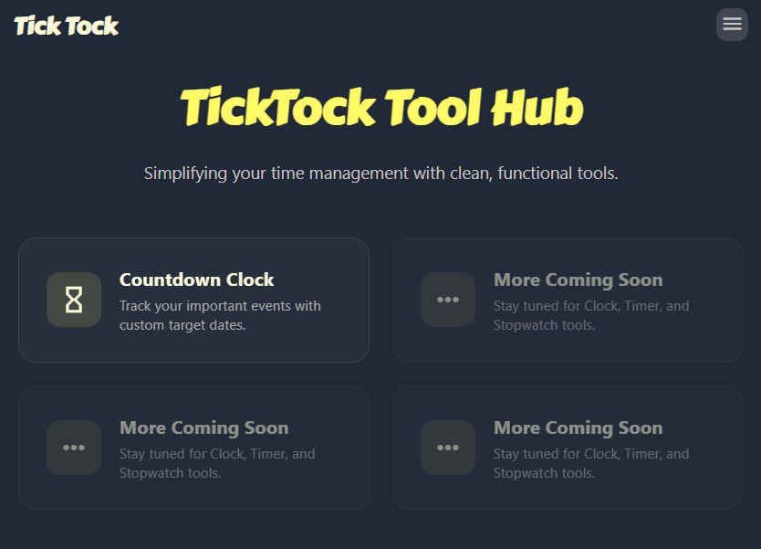

<table align="center" border="0" cellpadding="0" cellspacing="10">
    <tr>
        <td width="50%"></td>
        <td width="50%"></td>
    </tr>
    <tr>
        <td>Home</td>
        <td>Countdown</td>
    </tr>
</table>

<div style="text-align: center; font-size: 3rem; font-weight: bold;">
    <a href="https://klhrd.github.io/TickTock/">
        TickTock
    </a>
</div>

<p align="center">
    
    
    <br>
    
    
    
    
    
</p>

TickTock started as a simple countdown page and has since evolved into **a hub of time-management utilities**. This project was originally created for **Stardance**, a Hack Club event, to help users track time in a clean and efficient way.

---

## Roadmap

TickTock will expand to include the following time utility tools:

- [x] [**Home Page Hub**](https://klhrd.github.io/TickTock/)
- [x] [**Long-term Countdown**](https://klhrd.github.io/TickTock/countdown)
- [ ] ⏳ **Pomodoro Timer** (coming soon)
- [ ] 🌐 **World Clock Board** (coming soon)
- [ ] 🎯 **Minimalist Timer** (coming soon)
- [ ] 📊 **Time Progress Bar** (coming soon)

---

## Project Architecture

The project is built using **Astro**, a modern web framework optimized for speed and component-based development.

```text
src/
├── layouts/
│   └── BaseLayout.astro       # Unified layout (Sidebar, Header, Overlay)
├── pages/
│   ├── index.astro            # Dashboard Hub / Home
│   └── countdown/
│       └── index.astro        # Countdown Clock tool page
├── scripts/
│   └── countdown.js           # Client-side countdown logic
└── styles/
    └── (Scoped styles within Astro components)

```

### Key Technical Implementations

* **Framework**: Astro (Static Site Generation - SSG).
* **Component Architecture**: Uses Astro `<slot />` elements to inject custom headers, menus, and content into a single `BaseLayout`.
* **Safe Client Scripts**: Scripts are loaded using the `?url` suffix to prevent Node.js build failures. Browser-specific APIs (`window`, `document`) are protected with environment checks (`typeof window !== 'undefined'`) so they only run on the client side.
* **Responsive Grid**: The dashboard uses a CSS Grid `repeat(auto-fit, minmax(300px, 1fr))` layout with `box-sizing: border-box` to look clean on both mobile and desktop screens.

---

## Deployment & CI/CD

This project is configured for automated deployment via **GitHub Actions** to **GitHub Pages**.

* **Workflow**: Configured in `.github/workflows/deploy.yml`.
* **Environment**: Runs on Node.js 24 and executes `npm run build`.
* **Production URL**: [https://klhrd.github.io/TickTock/](https://klhrd.github.io/TickTock/) (Uses `/TickTock` as the base path).

---

## Getting Started

Make sure you have [Node.js](https://nodejs.org/) installed, then run the following commands in your terminal:

```bash
npm install          # Install dependencies
npm run dev          # Start local development server
npm run build        # Build for production (Checks for SSR/build errors)
npm run preview      # Preview the production build locally

```

For more detailed guides on how to work with Astro projects, check out the official [Astro Documentation](https://docs.astro.build/).

