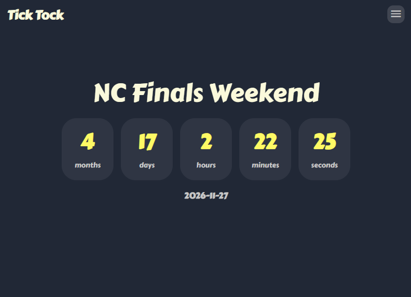

# Tick Tock
A long-term countdown timer for events.

## Features
- Live Countdown
    - Full mode
    - Days mode
- Customizable
    - Change Target Date
    - Edit Event Title
- automatically save in localStorage & url#
- share btn
- Dark Mode UI
- Lightweight

## Built With
- Astro
- NodeJS
- HTML5
- CSS3
- JavaScript

## How to Use
- Go [website](https://klhrd.github.io/TickTock/countdown) Website

### Try Some Samples
- [2027 New Year](https://klhrd.github.io/TickTock/countdown/#2027-01-01&New%20Year)
- [NC Finals Weekend](https://klhrd.github.io/TickTock/countdown/#2026-11-27&NC%20Finals%20Weekend)
- [US Open](https://klhrd.github.io/TickTock/countdown/#2026-08-31&US%20Open)