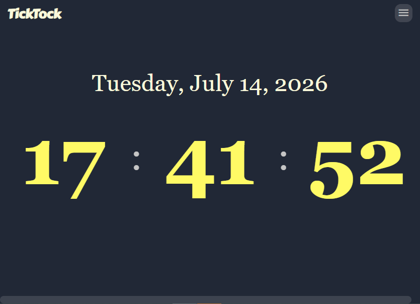

# TickTock - Digital Clock
A beautiful, highly customizable responsive digital clock with seamless state memory.

## Features
- Dynamic Clock Display
    - 12-hour format (with Ante/Post Meridiem labels)
    - 24-hour format
- Adaptive Typography
    - Modern Sans, Classic Serif, and Tech Mono font styles
    - Automated global layout scaling and stabilization
- Fluid Trigonometric Oscillations
    - Smooth colon breathing effects calculated via native `Math.sin()` loops
- Persistent Syncing
    - Automatically saves preferences to `localStorage` & `url#` hash
- Instant Sharing & Control
    - One-click configuration share button and native HTML5 Fullscreen mode
- Lightweight Dark Mode UI

## Built With
- Astro
- NodeJS
- HTML5
- CSS3
- JavaScript

## How to Use
- Visit the [Live Website](https://klhrd.github.io/TickTock/digital-clock)

### Try Some Samples
- [12H Tech Mono View](https://klhrd.github.io/TickTock/digital-clock/#12hr&mono)
- [24H Classic Serif View](https://klhrd.github.io/TickTock/digital-clock/#24hr&serif)
- [Standard Modern Sans View](https://klhrd.github.io/TickTock/digital-clock/#24hr&sans)

